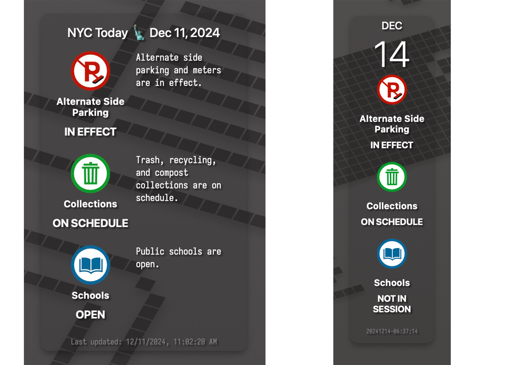

# AltSidePark.widget
AltSidePark.widget is my attempt at an Übersicht widget.

A widget to display the daily alternate side parking status. it uses a node proxy server to gather the data it will render. This was a journey.



## Fonts needed

* SF Pro
* SF Pro Display
* Iosevka Term

### How to get the fonts

* https://developer.apple.com/fonts/
* brew install font-hack-nerd-font
* brew install font-iosevka
* brew install font-iosevka-nerd-font

# Setup

## Setup a node Proxy Server

`npm install express http-proxy-middleware`

`npm install cors`

`npm install express axios`

`npm install axios node-cron`

`mkdir -p ~/bin/Ubersicht-proxy/`

`cd ~/bin/Ubersicht-proxy/`

`npm init -y`

### ~/bin/Ubersicht-proxy/node server.js
This simple proxy server collects and stores Alternate Side Parking information daily. Additionally, it saves this data to the file `altSideParkingData.json`. The server provides an API that enables requests to re-fetch the data from the URL `http://localhost:3000/api/updateAltSideParking`.

`cd ~/bin/Ubersicht-proxy/`

`node server.js`

```js
const express = require('express');
const axios = require('axios');
const fs = require('fs');
const cors = require('cors');
const cron = require('node-cron');

const app = express();
const PORT = 3000;

// Enable CORS for all origins (or limit to your widget's origin)
app.use(cors({
  origin: 'http://127.0.0.1:41416', // Allow only your widget's origin
  methods: 'GET, OPTIONS',
  allowedHeaders: 'Content-Type, Authorization',
}));

// Function to get the current date in 'YYYY-MM-DD' format
const getCurrentDate = () => {
  const now = new Date();
  const year = now.getFullYear();
  const month = String(now.getMonth() + 1).padStart(2, '0'); // Month is 0-indexed
  const day = String(now.getDate()).padStart(2, '0');
  return `${year}-${month}-${day}`;
};

// Function to fetch data (from the NYC 311 API )and save it to a file with lastUpdated timestamp
const fetchAndSaveData = async () => {
  try {
    const today = getCurrentDate(); // Get today's date dynamically
    console.log(`Fetching data for date: ${today}`);
  
    // Make a request to the NYC 311 API with the dynamic date
    const response = await axios.get(`https://portal.311.nyc.gov/home-cal/?today=${today}`);
  
    // Add the current timestamp to the response data
    const dataWithTimestamp = {
      ...response.data,
      lastUpdated: new Date().toISOString(), // Add timestamp in ISO format
    };
  
    // Save the response data with timestamp to a file
    fs.writeFileSync('altSideParkingData.json', JSON.stringify(dataWithTimestamp, null, 2));
    console.log('Data saved to altSideParkingData.json with timestamp');
  } catch (error) {
    console.error('Error fetching data from NYC 311 API:', error);
  }
};

// Schedule the fetch to run once a day (every 24 hours)
cron.schedule('0 0 * * *', () => {
  console.log('Running scheduled data fetch...');
  fetchAndSaveData();
});

// Route to manually fetch and update the data
app.get('/api/updateAltSideParking', async (req, res) => {
  try {
    const today = getCurrentDate(); // Get today's date dynamically
    console.log(`Manually fetching data for date: ${today}`);
  
    // Make a request to the NYC 311 API with the dynamic date
    const response = await axios.get(`https://portal.311.nyc.gov/home-cal/?today=${today}`);
  
    // Save the response data to a file
    fs.writeFileSync('altSideParkingData.json', JSON.stringify(response.data, null, 2));
    console.log('Data manually saved to altSideParkingData.json');
    res.json({ message: 'Data manually updated successfully' });
  } catch (error) {
    console.error('Error fetching data from NYC 311 API:', error);
    res.status(500).json({ error: 'Error fetching data from NYC 311 API' });
  }
});

// Serve the static JSON file for altSideParking with last updated timestamp
app.get('/api/altSideParking', (req, res) => {
  fs.readFile('altSideParkingData.json', 'utf8', (err, fileData) => {
    if (err) {
      res.status(500).json({ error: 'Unable to read data from static file' });
    } else {
      try {
        // Get the file's last modified timestamp
        const fileStats = fs.statSync('altSideParkingData.json');
        const lastModified = fileStats.mtime; // Modification time

        // Parse the JSON data and append the last updated timestamp
        const jsonData = JSON.parse(fileData);
        jsonData.lastUpdated = lastModified; // Add timestamp to the same structure

        // Send the modified data
        res.json(jsonData);
      } catch (statErr) {
        res.status(500).json({ error: 'Error reading file metadata' });
      }
    }
  });
});

// Start the server
app.listen(PORT, () => {
  console.log(`Proxy server running at http://localhost:${PORT}`);
  // Initial fetch when the server starts (just in case you want it to start immediately)
  fetchAndSaveData();
});

```
## Setup a launchctl script to launch the server at login.
We create a LaunchAgent to start the server and keep it running. The file lives in the `/Users` directory, and the user name needs to be hard coded in the file. Replace [$USER] with your username. 

### ~/Library/LaunchAgents/com.user.ubersichtproxy.runner.plist

```xml
<?xml version="1.0" encoding="UTF-8"?>
<!DOCTYPE plist PUBLIC "-//Apple//DTD PLIST 1.0//EN" "http://www.apple.com/DTDs/PropertyList-1.0.dtd">
<plist version="1.0">
<dict>
	<key>Label</key>
	<string>com.user.ubersichtproxy</string>
	<key>ProgramArguments</key>
	<array>
		<string>/opt/homebrew/bin/node</string>
		<string>/Users/[$USER]/bin/Ubersicht-proxy/server.js</string>
	</array>
	<key>RunAtLoad</key>
	<true/>
	<key>KeepAlive</key>
	<dict>
		<key>Crashed</key>
		<true/>
		<key>SuccessfulExit</key>
		<false/>
	</dict>
	<key>StandardErrorPath</key>
	<string>/tmp/ubersichtproxy.err</string>
	<key>StandardOutPath</key>
	<string>/tmp/ubersichtproxy.out</string>
	<key>WorkingDirectory</key>
	<string>/Users/*USER*/bin/Ubersicht-proxy</string>
</dict>
</plist>
```

## AltSidePark.widget

### AltSider.jsx
A .jsx file defines the widget. It gets its data from the running server `const API_URL = "http://localhost:3000/api/altSideParking"; // Fetch from the local server` and it will not run unless the server is running. I am still experimenting with this as it is probably wiser to just server the altSideParkingData.json file

```jsx
const API_URL = "http://localhost:3000/api/altSideParking"; // Fetch from the local server

// Helper function to get the current date in uppercase "DEC" and "12" format, with the weekday
const getCurrentDate = () => {
  const now = new Date();
  const formatter = new Intl.DateTimeFormat('en-US', { month: 'short', day: 'numeric', weekday: 'long' });
  const parts = formatter.formatToParts(now);
  const weekday = parts.find(part => part.type === 'weekday').value.toLowerCase(); // e.g., "saturday"
  const month = parts.find(part => part.type === 'month').value.toUpperCase();    // e.g., "DEC"
  const day = parts.find(part => part.type === 'day').value;                      // e.g., "14"

  return { weekday, month, day };
};

// Helper function to format the timestamp to "YYYYMMDD-HH:mm:ss"
const formatTimestamp = (timestamp) => {
  const date = new Date(timestamp);

  // Get date parts (year, month, day)
  const year = date.getFullYear();
  const month = (date.getMonth() + 1).toString().padStart(2, '0'); // "01" to "12"
  const day = date.getDate().toString().padStart(2, '0'); // "01" to "31"

  // Get time parts (hours, minutes, seconds)
  const hours = date.getHours().toString().padStart(2, '0'); // "00" to "23"
  const minutes = date.getMinutes().toString().padStart(2, '0'); // "00" to "59"
  const seconds = date.getSeconds().toString().padStart(2, '0'); // "00" to "59"

  // Return in "YYYYMMDD-HH:mm:ss" format
  return `${year}${month}${day}-${hours}:${minutes}:${seconds}`;
};

// Check server availability // Wait to load widget until server is running!
const isServerAvailable = async (url) => {
  try {
    const response = await fetch(url, { method: "HEAD" });
    return response.ok;
  } catch {
    return false;
  }
};

// Command to fetch data
export const command = async () => {
  let serverAvailable = await isServerAvailable(API_URL);

  // Wait until server is available
  while (!serverAvailable) {
    await new Promise(resolve => setTimeout(resolve, 15000)); // Wait for 15 seconds
    serverAvailable = await isServerAvailable(API_URL); // Check again
  }

  try {
    const response = await fetch(API_URL);
    if (!response.ok) {
      throw new Error(`HTTP error! Status: ${response.status}`);
    }
    const data = await response.json();

    // Extract relevant calendar data
    const altSideParking = data.results.find(
      (item) => item.CalendarName === "Alternate Side Parking"
    );
    const recycling = data.results.find(
      (item) => item.CalendarName === "Collections"
    );
    const schools = data.results.find(
      (item) => item.CalendarName === "Schools"
    );

    // Get current date
    const { weekday, month, day } = getCurrentDate();

    // Helper function to determine status based on the current day
    const getStatus = (item) => {
      switch (weekday) {
        case 'saturday':
          return {
            status: item?.SaturdayRecordName || "Unknown",
            message: item?.SaturdayContentFormat || "No information available.",
          };
        case 'sunday':
          return {
            status: item?.SundayRecordName || "Unknown",
            message: item?.SundayContentFormat || "No information available.",
          };
        default: // Weekday
          return {
            status: item?.WeekDayRecordName || "Unknown",
            message: item?.WeekDayContentFormat || "No information available.",
          };
      }
    };

    // Format the lastUpdated timestamp if available
    const timestamp = data.lastUpdated ? formatTimestamp(data.lastUpdated) : "ts:Unknown";

    return {
      altSideParking: {
        ...getStatus(altSideParking),
        icon: "AltSidePark.Widget/images/utility-icon-parking-fillcolor.svg", // Image for AltSide Parking
      },
      recycling: {
        ...getStatus(recycling),
        icon: "AltSidePark.Widget/images/utility-icon-sanitation-fillcolor.svg", // Image for Recycling
      },
      schools: {
        ...getStatus(schools),
        icon: "AltSidePark.Widget/images/utility-icon-school-fillcolor.svg", // Image for Schools
      },
      month,
      day,
      timestamp,
    };
  } catch (err) {
    return {
      error: `Error fetching data: ${err.message}`,
    };
  }
};


// Render the widget
export const render = ({ output }) => {
  if (output?.error) {
    return (
      <div className="widget">
        <p className="error">{output.error}</p>
      </div>
    );
  }

  return (
    <div className="widget">
      <h1 className="widget-title">NYC Today 🗽 {output.dateCollected} </h1>

      <section className="status-section">
        <div className="status-left">
          
          <p className="status-label">
            <strong>Alternate Side Parking</strong>
          </p>
          <p className="status-text">{output?.altSideParking?.status || "Loading..."}</p>
        </div>
        <div className="status-right">
          <p className="status-message">{output?.altSideParking?.message || "Fetching data..."}</p>
        </div>
      </section>

      <section className="status-section">
        <div className="status-left">
          
          <p className="status-label">
            <strong>Collections</strong>
          </p>
          <p className="status-text">{output?.recycling.status || "Loading..."}</p>
        </div>
        <div className="status-right">
          <p className="status-message">{output?.recycling.message || "Fetching data..."}</p>
        </div>
      </section>

      <section className="status-section">
        <div className="status-left">
          
          <p className="status-label">
            <strong>Schools</strong>
          </p>
          <p className="status-text">{output?.schools.status || "Loading..."}</p>
        </div>
        <div className="status-right">
          <p className="status-message">{output?.schools.message || "Fetching data..."}</p>
        </div>
      </section>

      <footer>
        <p className="timestamp">Last updated: {output.timestamp}</p>
      </footer>
    </div>
  );
};

// CSS Styling (No changes here)
export const className = `
  .widget {
    position: absolute;
    top: 40px;
    left: 1010px;
    padding: 20px;
    font-family: 'SF Pro', Arial, sans-serif;
    font-size: 16px;
    color: white;
    background-color: rgba(0, 0, 0, 0.1);
    border-radius: 10px;
    width: 220px;
    box-shadow: 0 4px 8px rgba(0, 0, 0, 0.3);
  }

  .widget-title {
    font-family: 'SF Pro Display','Hack Nerd Font', 'Iosevka Term', 'SF Pro', Arial, sans-serif;
    font-size:16px;
    font-weight: 500;
    margin-top: -10px;
    margin-bottom: 12px;
    color: white;
    text-align: center;
    text-shadow: 2px 2px 2px rgba(0, 0, 0, 0.5);
  }

  .status-section {
    display: flex;
    margin-bottom: 15px;
  }

  .status-left {
    flex: 0 0 100px;
    display: flex;
    flex-direction: column;
    margin-right: 0px;
    margin-left:  0px;
    align-items: center;
  }

  .status-icon {
    width: 50px;
    height: auto;
    margin-left: -15px;
    margin-bottom: -5px;
  }

  .status-label {
    font-family: 'SF Pro','Iosevka Term','SF Pro', Arial, sans-serif;
    font-weight: 100;
    font-size: 12px;
    text-align: center;
    margin-bottom: -5px;
    margin-left: -15px;
    text-shadow: 2px 2px 2px rgba(0, 0, 0, 0.5);
  }

  .status-text {
    font-family: 'SF Pro Display','Iosevka Term','SF Pro', Arial, sans-serif;
    font-size: 14px;
    font-weight: 700;
    color: #FFFFFF;
    text-align: center;
    margin-bottom: 5px;
    margin-left: -15px;
    text-shadow: 2px 2px 2px rgba(0, 0, 0, 0.5);
  }

  .status-right {
    flex: 1;
    margin-left: -10px;
    display: flex;
    flex-direction: column;
    justify-content: flex-start;
  }

  .status-message {
    font-family: 'Iosevka Term','SF Pro', Arial, sans-serif;
    font-size: 12px;
    text-align: left;
    font-style: normal;
    margin-top:  0px;
    margin-left: 10px;
    text-shadow: 2px 2px 2px rgba(0, 0, 0, 0.5);    
  }

  .error {
    color: red;
    text-align: center;
  }

  footer {
    margin-top: 5px;
    text-align: center;
    font-size: 12px;
    color: lightgray;
  }

  .timestamp {
    font-family: 'Iosevka Term','SF Pro', Arial, sans-serif;
    font-size: 10px;
    color: grey;
    margin-bottom: -15px;
    text-shadow: 2px 2px 2px rgba(0, 0, 0, 0.5);    
  }
`;
```
